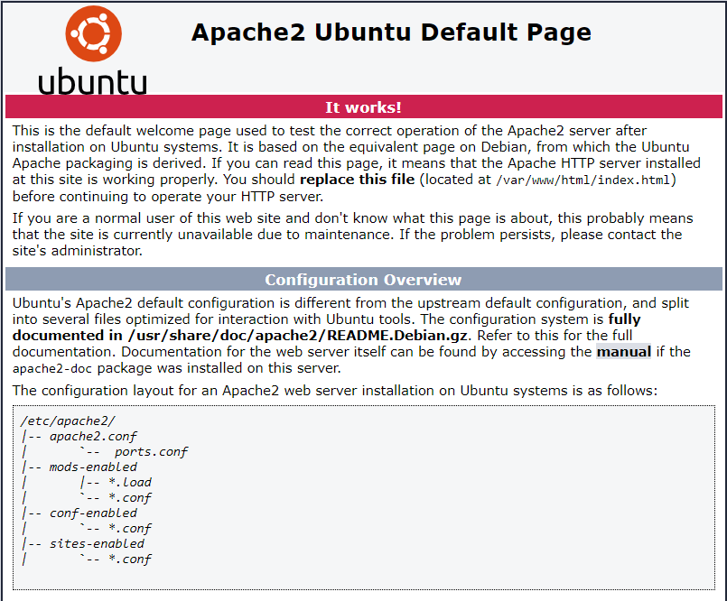
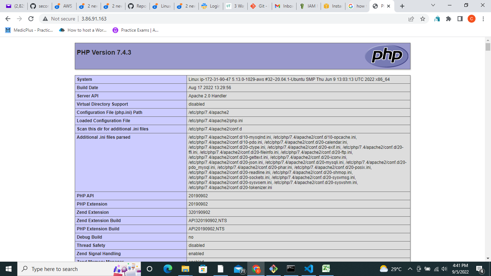

## Awesome Documentation of Project 1

**INSTALLING APACHE AND UPDATING THE FIREWALL**
```#update a list of packages in package manager
sudo apt update

#run apache2 package installation
sudo apt install apache2
```

verify that apache2 is running

`sudo systemctl status apache2`

we have TCP port 22 open by default on our EC2 machine to access it via SSH, so we need to add a rule to EC2 configuration to open inbound connection through port 80:

Our server is running and we can access it locally and from the Internet (Source 0.0.0.0/0 means ‘from any IP address’).

First, let us try to check how we can access it locally in our Ubuntu shell, run:

```
 curl http://localhost:80
or
 curl http://127.0.0.1:80
 ```

 `http://<Public-IP-Address>:80`

 Another way to retrieve your Public IP address, other than to check it in AWS Web console, is to use following command:

 `curl -s http://169.254.169.254/latest/meta-data/public-ipv4`



## INSTALLING MYSQL

`sudo apt install mysql-server`

Log in to the MySQL console by typing:

`sudo mysql`

``` sql
Welcome to the MySQL monitor.  Commands end with ; or \g.
Your MySQL connection id is 11
Server version: 8.0.22-0ubuntu0.20.04.3 (Ubuntu)

Copyright (c) 2000, 2020, Oracle and/or its affiliates. All rights reserved.

Oracle is a registered trademark of Oracle Corporation and/or its
affiliates. Other names may be trademarks of their respective
owners.

Type 'help;' or '\h' for help. Type '\c' to clear the current input statement.

mysql> 
```
It’s recommended that you run a security script that comes pre-installed with MySQL. This script will remove some insecure default settings and lock down access to your database system. Before running the script you will set a password for the root user, using mysql_native_password as default authentication method. We’re defining this user’s password as PassWord.1.

`ALTER USER 'root'@'localhost' IDENTIFIED WITH mysql_native_password BY 'PassWord.1';`

`mysql> exit`

`sudo mysql_secure_installation`

**Note**: Enabling this feature is something of a judgment call. If enabled, passwords which don’t match the specified criteria will be rejected by MySQL with an error. It is safe to leave validation disabled, but you should always use strong, unique passwords for database credentials.

```
VALIDATE PASSWORD PLUGIN can be used to test passwords
and improve security. It checks the strength of password
and allows the users to set only those passwords which are
secure enough. Would you like to setup VALIDATE PASSWORD plugin?

Press y|Y for Yes, any other key for No:
```

If you answer “yes”, you’ll be asked to select a level of password validation.

```
There are three levels of password validation policy:

LOW    Length >= 8
MEDIUM Length >= 8, numeric, mixed case, and special characters
STRONG Length >= 8, numeric, mixed case, special characters and dictionary              file

Please enter 0 = LOW, 1 = MEDIUM and 2 = STRONG: 1
```

If you enabled password validation, you’ll be shown the password strength for the root password

```
Estimated strength of the password: 100 
Do you wish to continue with the password provided?(Press y|Y for Yes, any other key for No) : y
```

When you’re finished, test if you’re able to log in to the MySQL console by typing:

`sudo mysql -p`

Notice the -p flag in this command, which will prompt you for the password used after changing the **root** user password.

`mysql> exit`

## INSTALLING PHP

`sudo apt install php libapache2-mod-php php-mysql`

Once the installation is finished, you can run the following command to confirm your PHP version:

`php -v`

```
PHP 7.4.3 (cli) (built: Oct  6 2020 15:47:56) ( NTS )
Copyright (c) The PHP Group
Zend Engine v3.4.0, Copyright (c) Zend Technologies
```

## CREATING A VIRTUAL HOST FOR YOUR WEBSITE USING APACHE

Create the directory for `projectlamp` using `‘mkdir’` command as follows:

`sudo mkdir /var/www/projectlamp`

Next, assign ownership of the directory with your current system user:

`sudo chown -R $USER:$USER /var/www/projectlamp`

Then, create and open a new configuration file in Apache’s `sites-available` directory using your preferred command-line editor. Here, we’ll be using `vi` or `vim` (They are the same by the way):

`sudo vi /etc/apache2/sites-available/projectlamp.conf`

Paste in the following

```
<VirtualHost *:80>
    ServerName projectlamp
    ServerAlias www.projectlamp 
    ServerAdmin webmaster@localhost
    DocumentRoot /var/www/projectlamp
    ErrorLog ${APACHE_LOG_DIR}/error.log
    CustomLog ${APACHE_LOG_DIR}/access.log combined
</VirtualHost>
```

To save and close the file, simply follow the steps below:

1. Hit the `esc` button on the keyboard
2. Type `:`
3. Type `wq.` w for `write` and q for `quit`
4. Hit `ENTER` to save the file
You can use the `ls` command to show the new file in the **sites-available** directory

`sudo ls /etc/apache2/sites-available`

You will see something like this;

`000-default.conf  default-ssl.conf  projectlamp.conf`

You can now use a2ensite command to enable the new virtual host:

`sudo a2ensite projectlamp`

You might want to disable the default website that comes installed with Apache. This is required if you’re not using a custom domain name, because in this case Apache’s default configuration would overwrite your virtual host. To disable Apache’s default website use **a2dissite** command , type:

`sudo a2dissite 000-default`

To make sure your configuration file doesn’t contain syntax errors, run:

`sudo apache2ctl configtest`

Finally, reload Apache so these changes take effect:

`sudo systemctl reload apache2`

Your new website is now active,Now go to your browser and try to open your website URL using IP address:

`http://<Public-IP-Address>:80`

You can leave this file in place as a temporary landing page for your application until you set up an `index.php` file to replace it. Once you do that, remember to remove or rename the `index.html` file from your document root, as it would take precedence over an `index.php` file by default.

##  ENABLE PHP ON THE WEBSITE
With the default DirectoryIndex settings on Apache, a file named index.html will always take precedence over an `index.php` file. This is useful for setting up maintenance pages in PHP applications, by creating a temporary `index.html` file containing an informative message to visitors. Because this page will take precedence over the `index.php` page, it will then become the landing page for the application. Once maintenance is over, the `index.html` is renamed or removed from the document root, bringing back the regular application page.

In case you want to change this behavior, you’ll need to edit the `/etc/apache2/mods-enabled/dir.conf` file and change the order in which the `index.php` file is listed within the `DirectoryIndex` directive:

`sudo vim /etc/apache2/mods-enabled/dir.conf`

```
<IfModule mod_dir.c>
        #Change this:
        #DirectoryIndex index.html index.cgi index.pl index.php index.xhtml index.htm
        #To this:
        DirectoryIndex index.php index.html index.cgi index.pl index.xhtml index.htm
</IfModule>
```

After saving and closing the file, you will need to reload Apache so the changes take effect:

`sudo systemctl reload apache2`

Finally, we will create a PHP script to test that PHP is correctly installed and configured on your server.

Now that you have a custom location to host your website’s files and folders, we’ll create a PHP test script to confirm that Apache is able to handle and process requests for PHP files.

Create a new file named `index.php` inside your custom web root folder:

`vim /var/www/projectlamp/index.php`

This will open a blank file. Add the following text, which is valid PHP code, inside the file:

``` php
<?php
phpinfo();
```

 Save and close the file

 

 After checking the relevant information about your PHP server through that page, it’s best to remove the file you created as it contains sensitive information about your PHP environment -and your Ubuntu server. You can use rm to do so:

 `sudo rm /var/www/projectlamp/index.php`

 You can always recreate this page if you need to access the information again later.

 ## Congratulations!

